<br><br> 

<h1>
<p align = "center" background-color = "darkgray">
            <strong>Dog Breed Image Classification</strong>
</p>  
</h1>
<h2>
<p align = "center">
    End-to-end Deep Learning Project for
    <br>Dog Breed Multi-Class Image Classification:
    <br>EDA, Transfer Learning, Fine-Tuning, and Model Deployment
</p>
</h2>

# 1. Introduction

## Background

In recent years, the canine population has witnessed a surge in the number of mixed-breed dogs. While the charm of mixed-breed dogs lies in their one-of-a-kind characteristics, the increasing variety poses challenges when it comes to identifying their specific breeds. This is where a classification model proves to be invaluable.

Creating a classification model for identifying breeds of dogs can serve various purposes including:
- Lost and found services to help efficiently reunite lost dogs with owners.
- Educational tools through interactive websites or mobile applications to learn about different breeds.
- Pet adoption platforms to identify breeds within shelters, enhancing adoptiong and rehoming processes.
- Dog shows and competitions to assist judges in verifying participating dog breeds.

The following study explores the multi-class [stanford dogs image dataset](https://www.kaggle.com/datasets/jessicali9530/stanford-dogs-dataset), then uses transfer learning to train and fine-tune four modern neural network architectures. We'll use built-in [Keras applications](https://keras.io/api/applications) to use architectures with pre-trained ImageNet weights for the following models: 
- [xception](https://arxiv.org/abs/1610.02357)
- [InceptionResNetV2](https://arxiv.org/abs/1602.07261)
- [EfficientNetB3](https://arxiv.org/abs/1905.11946)
- [ConvNeXtSmall](https://arxiv.org/abs/2201.03545)

Finally, we'll save the best model with tensorflow lite, create a docker image for the environment with minimized dependencies, deploy it to the cloud using AWS Lambda and with Streamlit.

**WARNING**: Do not attempt to run the enitre notebook without a CUDA-enabled GPU. The models may take hours or even days to train. See section 3.2 for more information on how to check for an available GPU.

## Table of Contents.

The table of contents for the repository is as follows.

### 1. Introduction
- Description of the project methodology and real world use-case.
- Table of contents **(We Are Here)**
- Repository structure
- Dataset source and information.
### 2. Prerequisites
- Software
- Clone the repository
- Download data
- Local conda environment setup, including tensorflow installation.
### 3. Analysis
- EDA
- Tune Xception, InceptionResNetV2, EfficientNetB3, ConvNeXtSmall
- Comparison and analysis of all four tuned models to determine the final model: EfficientNetB3V2
### 4. Serverless AWS Deployment
- Local deployment with Docker
    - Test with test.py -t local
    - Model prediction with lambda_function.py
- Cloud deployment with AWS Lambda
    - Test with test.py -t cloud
    - Model prediction with lambda_function.py
### 5. Kubernetes Deployment
- Local deployment with Docker
    - Test local tf-serving model with kubernetes/test.py -t serving
    - Test local gateway with kubernetes/test.py -t gateway
    - Model prediction with proto.py and gateway.py
### 6. Application Deployment
- Application deployment with Streamlit
    - Local deployment for testing
    - Model prediction with streamlit_app.py
### 5. References
- References for all model architectures and Keras documentation


## Repository Structure

The following details the files stored in this repository. Note that the inception and convnext models were excluded due to large file size.


```
dog-prediction
│   README.md
|   Dockerfile - Set up environment with minimized dependencies for local and cloud deployment
│   requirements.txt - Set up local environment for running notebook
│
└───data - Unzip the dataset to this folder (section 2.3)
│   
└───figures - Contains images for the notebook and readme
|
└───models
|   │   effnetV2B3_model.keras
|   │   Xception_model.keras
|   │   model.tflite - Tflite model with minimized dependencies for serverless deployment
|   │   converted_model - Tensorflow model for kubernetes deployment with tf-serving
|
└───python
|   │   convnext.py - Hotfix for saving convnext models with tensorflow 2.10
|   │   lambda_function.py - Function for AWS Lambda cloud deployment
|   │   notebook.ipynb - EDA, modeling and hyperparameter tuning - training output removed
|   │   notebook-orig.ipynb - EDA, modeling and hyperparameter tuning - training output kept
|   │   test.py - Tests serverless local and cloud inference
|   │   streamlit_app.py - Application for streamlit cloud
|
└───kubernetes
    │   docker-compose.yaml - Docker Compose file for setting up multi-container network
    │   image-gateway.dockerfile - Dockerfile for running gateway container to post predictions to the model
    │   image-model.dockerfile - Dockerfile for running model container to accept posts for predictions
    │   Pipfile - Pipfile for building gateway container environment
    │   Pipfile.lock - Pipfile lock for building gateway container environment
    │   gateway.py - Flask application that connects to tf-serving model
    │   proto.py - Converts model to proto for efficient deployment and inference
    │   test.py - Tests kubernetes local and cloud inference
```

## Dataset Source

The Stanford Dogs dataset contain images of dogs from around the world. It is primarily used for image categorization of dog breeds. The version for this project can be downloaded from [Kaggle - Stanford Dogs Dataset](https://www.kaggle.com/datasets/jessicali9530/stanford-dogs-dataset).
- Dog breeds: 120
- Number of images: 20,580
- This project uses the "Images" folder which is divided into subfolders by class (dog breed)

Further observation of the data can be found in section 3.2 EDA

# 2. Prerequisites

## Software

```
- Docker
    - [Official installation documentation](https://docs.docker.com/engine/install/) for Docker Engine.
- Anaconda or Miniconda
    - [Official installation documentation](https://docs.anaconda.com/free/anaconda/install/index.html). Install with CLI tools.
- Python 3.10
    - This should be installed with the environment setup, but note the [official python download page](https://www.python.org/downloads/) for reference.
- Tensorflow 2.10
    - This should be installed with the environment setup, but installation instructions could vary depending on OS. Please refer to the [official documentation](https://www.tensorflow.org/install/pip) for your machine.
```

## Clone the repository
```
git clone https://github.com/PriyaVellanki/flower_classification.git
```

## Data download

Download the dataset from [Kaggle - Stanford Dogs Dataset](https://www.kaggle.com/datasets/jessicali9530/stanford-dogs-dataset). Extract the contents of the zip file to the ``data`` folder. Ensure that the folder structure is as follows before proceeding.

```
data
│
└───annotations
│   │
│   └──── Annotation
└───images
    │
    └──── Images
```

## Local conda environment setup, including tensorflow installation.

The following will create a conda environment with the necessary requirements for this project.

``conda create --name dog-prediction python=3.10``

``conda activate dog-prediction``

``pip install -r requirements.txt``

This project was created with tensorflow 2.10.0 with GPU support for windows cuda tool kit 11.2 and nvidia cuda-nvcc. The tensorflow installation for your OS may be different. Please refer to the [official documentation](https://www.tensorflow.org/install/pip). 

For a windows build with a cuda-enabled nvidia graphics card, please run the following commands.

``conda install -c conda-forge cudatoolkit=11.2 cudnn=8.1.0``

``conda install -c nvidia cuda-nvcc``


# 3. Directions

The EDA, data preparation, model tuning and comparison were completed in the project notebook. A condensed notebook with outputs for training modules are cleared for enhanced readability is stored [here](python\notebook.ipynb). A notebook with training outputs is stored [here](python\notebook-orig.ipynb). The prerequisites from the previous section should prepare you to follow along with the notebook.

## EDA

To explore the data, we first looked at the full list of classes, or dog breeds, stripped from the folder structure names.

```
List of categories =  ['Chihuahua', 'Japanese spaniel', 'Maltese dog', 'Pekinese', 'Shih tzu', 'Blenheim spaniel', 'Papillon', 'Toy terrier', 'Rhodesian ridgeback', 'Afghan hound', 'Basset', 'Beagle', 'Bloodhound', 'Bluetick', 'Black and tan coonhound', 'Walker hound', 'English foxhound', 'Redbone', 'Borzoi', 'Irish wolfhound', 'Italian greyhound', 'Whippet', 'Ibizan hound', 'Norwegian elkhound', 'Otterhound', 'Saluki', 'Scottish deerhound', 'Weimaraner', 'Staffordshire bullterrier', 'American staffordshire terrier', 'Bedlington terrier', 'Border terrier', 'Kerry blue terrier', 'Irish terrier', 'Norfolk terrier', 'Norwich terrier', 'Yorkshire terrier', 'Wire haired fox terrier', 'Lakeland terrier', 'Sealyham terrier', 'Airedale', 'Cairn', 'Australian terrier', 'Dandie dinmont', 'Boston bull', 'Miniature schnauzer', 'Giant schnauzer', 'Standard schnauzer', 'Scotch terrier', 'Tibetan terrier', 'Silky terrier', 'Soft coated wheaten terrier', 'West highland white terrier', 'Lhasa', 'Flat coated retriever', 'Curly coated retriever', 'Golden retriever', 'Labrador retriever', 'Chesapeake bay retriever', 'German short haired pointer', 'Vizsla', 'English setter', 'Irish setter', 'Gordon setter', 'Brittany spaniel', 'Clumber', 'English springer', 'Welsh springer spaniel', 'Cocker spaniel', 'Sussex spaniel', 'Irish water spaniel', 'Kuvasz', 'Schipperke', 'Groenendael', 'Malinois', 'Briard', 'Kelpie', 'Komondor', 'Old english sheepdog', 'Shetland sheepdog', 'Collie', 'Border collie', 'Bouvier des flandres', 'Rottweiler', 'German shepherd', 'Doberman', 'Miniature pinscher', 'Greater swiss mountain dog', 'Bernese mountain dog', 'Appenzeller', 'Entlebucher', 'Boxer', 'Bull mastiff', 'Tibetan mastiff', 'French bulldog', 'Great dane', 'Saint bernard', 'Eskimo dog', 'Malamute', 'Siberian husky', 'Affenpinscher', 'Basenji', 'Pug', 'Leonberg', 'Newfoundland', 'Great pyrenees', 'Samoyed', 'Pomeranian', 'Chow', 'Keeshond', 'Brabancon griffon', 'Pembroke', 'Cardigan', 'Toy poodle', 'Miniature poodle', 'Standard poodle', 'Mexican hairless', 'Dingo', 'Dhole', 'African hunting dog'] 
```

We computed metrics for the maximum, minimum and mean number of images within a class, the kurtosis and skew of the classes within the dataset. The dataset is highly skewed, with a skewness > 1, and platykurtic with a kurtosis < 3.

```
Max counts: 166
Min counts: 88
Mean counts: 109.758
Kurtosis: 0.788
Skew: 1.0138674098824882
Top 5 breeds: ['Afghan hound' 'Maltese dog' 'Scottish deerhound' 'Shih tzu' 'Samoyed']
Bottom 5 breeds: ['French bulldog' 'Doberman' 'Brittany spaniel' 'Welsh springer spaniel'
 'Bouvier des flandres']
```

A barchart showing the distribution over all classes. The maximum limit has been marked with a bold line, the minimum limit with a dashed line. We can see a large distribution between classes.

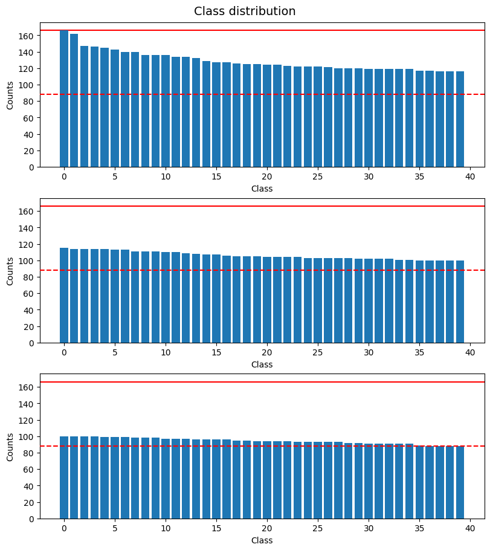

The top 5 and bottom 5 classes by number of images. Examples for both groups are shown in the notebook, with the top 5 shown below.

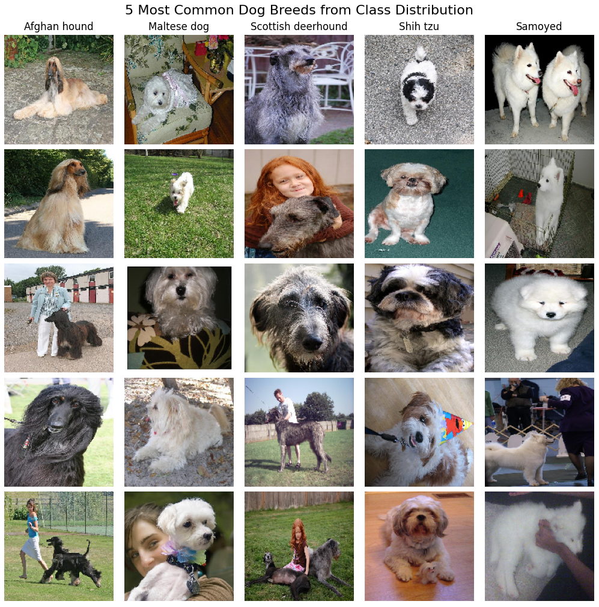


## Modeling

The models Xception, InceptionResNetV2, EfficientNetB3V2 and ConvNeXtSmall were chosen for their small number of parameters and comparable performance metrics. We used transfer learning to tune each keras models with pre-trained weights from training on the ImageNet dataset. The function ``make_model`` in section 4.1 of the notebook has the following features:
  - Takes any [keras application](https://keras.io/api/applications/) model as input and freezes the convolution layers and weights trained on ImageNet
  - Adds a trainable pooling layer, trainable dense layer, trainable dropout layer and second dense layer after the base model
  - Learning rate, inner layer size and dropout rate can be adjusted for hyperparameter tuning on these layers

Before training, we split the dataset into training and test sets. The test set was held out for final performance calculations, and we tuned the model parameters using a once again separated training and validation set. The final split training/validation/testing split was 60/20/20. The notebook uses seeds for reproducibility of results.

For each model, we used validation curves to tune within the following parameter ranges:

- Learning rate in [0.00001, 0.0001, 0.001, 0.01, 0.1]
- Inner layer size in [10, 50, 100, 250, 500, 1000]
- Dropout rate in [0.25, 0.4, 0.5, 0.6, 0.75]

We then unfroze the first 4 layers and re-trained the model with the best performing hyperparameters on the held-out test set. Each of the best performing models are compared in the following notebook section.


### Xception

- Reference: [xception: Deep Learning with Depthwise Separable Convolutions](https://arxiv.org/abs/1610.02357)

Xception is "a deep convolutional neural network architecture inspired by Inception, where Inception modules have been replaced with depthwise separable convolutions". It outperforms Inception V3 on ImageNet while having the same number of parameters by making more efficient use of these model parameters. From figure 5 of the paper, the xception architecture: the data first goes through the entry flow, then through the middle flow which is repeated eight times, and finally through the exit flow. Note that all Convolution and SeparableConvolution layers are followed by batch normalization. All SeparableConvolution layers use a depth multiplier of 1 (no depth expansion).

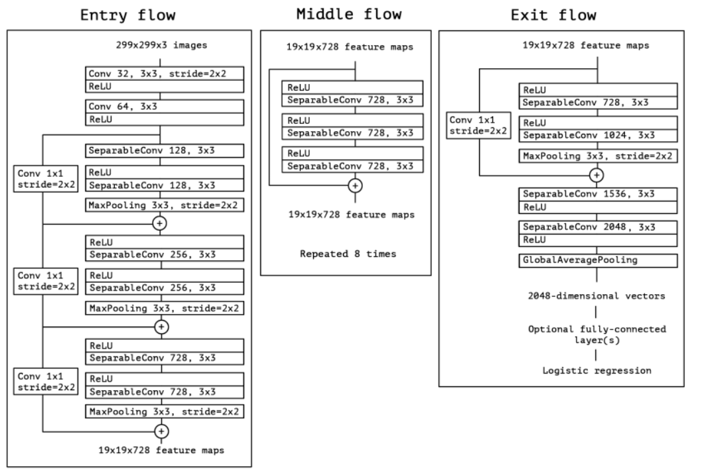

The tuned parameter values and performance metrics can be seen below. The trained tuned model is uploaded to [Xception_model.keras](models/Xception_model.keras).

Learning rate| Inner layer size | Dropout rate | Epochs | Test accuracy | Test precision | Test recall | Test f1
--- | --- | --- | --- | --- | --- | --- | ---
0.0001 | 100 | 0.4 | 13 | 0.901 | 0.898 | 0.900 | 0.897

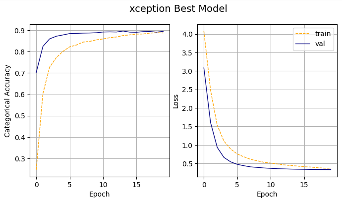


### InceptionResNetV2

- Reference: [Inception-v4, Inception-ResNet and the Impact of Residual Connections on Learning](https://arxiv.org/abs/1602.07261) (AAAI 2017)

Figures 3-9 from [Inception-v4, Inception-ResNet and the Impact of Residual Connections on Learning](https://arxiv.org/abs/1602.07261) (AAAI 2017). Figure 3 shows the architecture divided into blocks. The full architecture next to it is taken from figures 4-9. Note that each inception block is repeated the number of times as specified in figure 3, and also next to the Filter concat block. For Reduction-B, the k, l, m, n numbers represent filter bank sizes which can be looked up in Table 1.

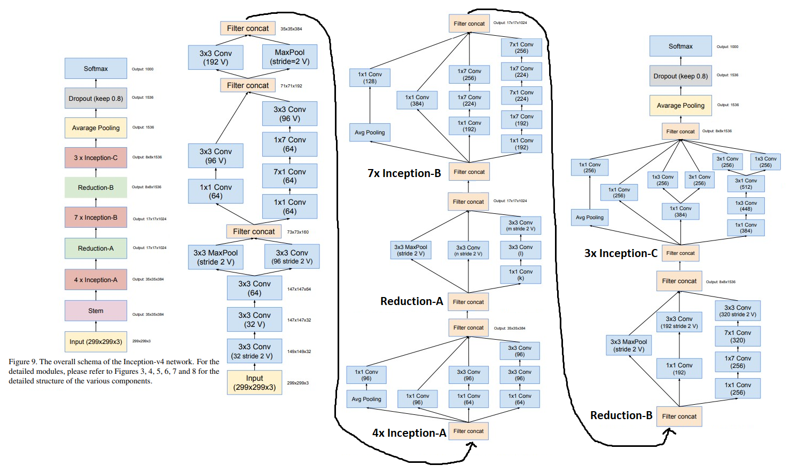

The tuned parameter values and performance metrics can be seen below. The trained tuned model was too large to upload to github and is excluded from the repository.

Learning rate| Inner layer size | Dropout rate | Epochs | Test accuracy | Test precision | Test recall | Test f1
--- | --- | --- | --- | --- | --- | --- | ---
0.0001 | 100 | 0.4 | 15 | 0.920 | 0.917 | 0.921 | 0.916

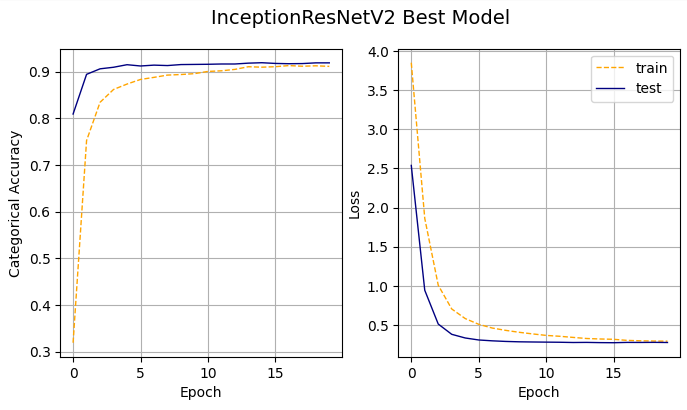


### EfficientNetB3V2

- Reference: [EfficientNet: Rethinking Model Scaling for Convolutional Neural Networks](https://arxiv.org/abs/1905.11946) (ICML 2019)

The EfficientNet baseline architecture leverages a multi-objective neural architecture search that optimizes both accuracy and FLOPS. EfficientNetB0 is shown in Table 1 below from the paper, using MBConv layers from ([Sandler et al., 2018](https://arxiv.org/abs/1801.04381); [Tan et al., 2019](https://arxiv.org/abs/1807.11626)). EfficientNetB3 is a scaled-up version, using uniform dimension scaling as shown in (e) from the figure 2 below.

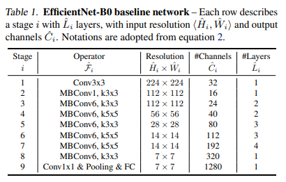
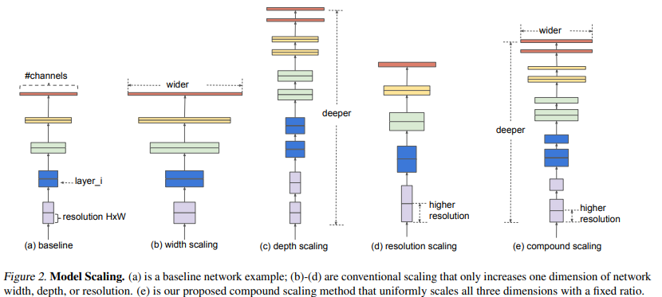

The tuned parameter values and performance metrics can be seen below. The trained tuned model is uploaded to [effnetV2B3_model.keras](models/effnetV2B3_model.keras).

Learning rate| Inner layer size | Dropout rate | Epochs | Test accuracy | Test precision | Test recall | Test f1
--- | --- | --- | --- | --- | --- | --- | ---
0.0001 | 250 | 0.6 | 18 | 0.920 | 0.917 | 0.921 | 0.916

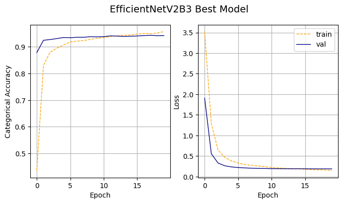


### ConvNeXtSmall

- Reference: [A ConvNet for the 2020s](https://arxiv.org/abs/2201.03545) (CVPR 2022)

ConvNeXt is a family of architectures that aims to make transformers viable for computer vision, aiding in tasks suck as object detection and semantic segmentation. They outperform other transformers while maintaining the simplicity and efficiency of standard ConvNets. Table 9 from the paper shows the architecture for ConvNeXt-T compared with ResNet-50 () and Swin-T (Ze et al, 2021)[https://arxiv.org/abs/2103.14030]. For differently sized ConvNeXts, only the number of blocks and the number of channels at each stage differ from ConvNeXt-T. The number of channels doubles at each new stage, so ConvNeXt-Small has double the number of channels.

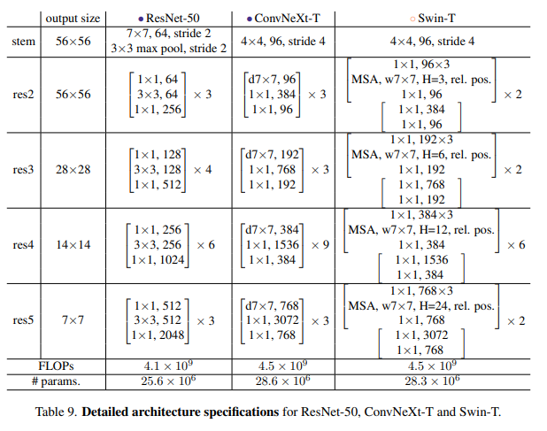

The tuned parameter values and performance metrics can be seen below. The trained tuned model was too large to upload to github and is excluded from the repository.

Learning rate| Inner layer size | Dropout rate | Epochs | Test accuracy | Test precision | Test recall | Test f1
--- | --- | --- | --- | --- | --- | --- | ---
0.0001 | 250 | 0.6 | 18 | 0.945 | 0.944 | 0.945 | 0.944

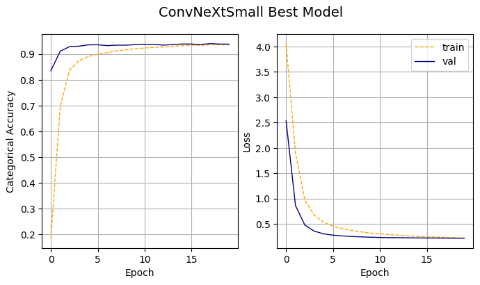


## Compare all models

The following table compiles performance metrics for all four trained models. EfficientNetB3V2 was our best performing model across all metrics. It also has the smallest size and a relatively small number of parameters, so we can assume it will run fairly fast. It was converted to tflite and saved to [model.tflite](models/model.tflite) for efficient performance during deployment.

Model | Size | Parameters (k) | Train Time (s) | Inference Time (s) | Test accuracy | Test precision | Test recall | Test f1
--- | --- | --- | --- | --- | --- | --- | --- | ---
Xception | 82.333 | 21078 | 70.203 | 12.696 | 0.901 | 0.898 | 0.900 | 0.897
InceptionV2 | 210.371 | 11198 | 100.762 | 24.258 | 0.920 | 0.917 | 0.921 | 0.916
EfficientNetB3V2 | 54.715 | 13344 | 66.558 | 13.107 | 0.945 | 0.944 | 0.945 | 0.944
ConvNeXtSmall | 191.716 | 49677 | 265.549 | 160.441 | 0.939 | 0.938 | 0.940 | 0.937


# 4. Serverless AWS Deployment
## Local Deployment

To deploy locally, navigate up to the root folder and run the following from a terminal or command prompt. Please note that docker must already be installed and running on your local machine. See the [official documentation](https://docs.docker.com/engine/install/) for Docker Engine installation.

- Build the container: `docker build -t dog-prediction .`
- Run the container: `docker run -it --rm -p 8080:8080 dog-prediction:latest`

This will build an image from the [dockerfile](../Dockerfile) using python 3.10, tflite and [lambda_function.py](lambda_function.py). Once the container is running, a test can be run from the python folder with the following command:

```
python python/test.py -t local
```

It should return the following response with the top 5 dog breeds ascending order, each followed by the corresponding model score.

```
[['Golden retriever', 4.919923782348633], ['Kuvasz', 1.704105019569397], ['Great pyrenees', 0.6640735268592834], ['Labrador retriever', -0.6828881502151489], ['Border collie', -0.9368569254875183]]
```

## Cloud Deployment

The model is also hosted on an AWS Lambda function with a docker image hosted on AWS ECR. To run inference on the cloud, run the following. It is expected to return the same response as for the locally deployed image.

```
python python/test.py -t cloud
```

# 5. Kubernetes Deployment
## Docker
To test our kubernetes deployment for the cloud, we first set up a multi-container environment with docker-compose. Model was resaved with tensorflow format to [model_converted](models/model_converted).

### Docker serving
A simple dockerfile is set up for to run a container with tf-serving. 
- Saved to [image-model.dockerfile](kubernetes/image-model.dockerfile).

First navigate to the root and build then run the container with the following commands. Test it to ensure that the setup is working as intended, and you should recieve that same predictions as shown section 4 for serverless deployment.

**Build**
> docker build -t dog-prediction-model:v1 -f kubernetes/image-model.dockerfile .

**Run**
> docker run -it --rm -p 8500:8500 dog-prediction-model:v1

**Test**
> python kubernetes/test.py -t serving

### Docker gateway
Another dockerfile is set up to run a container for the gateway with a flask application that points to the previous container at port 8500. 
- Saved to [image-gateway.dockerfile](../kubernetes/image-gateway.dockerfile).
- Builds the environment with [Pipfile](kubernetes/Pipfile) and [Pipfile.lock](kubernetes/Pipfile.lock)
- Uses the python files [gateway.py](kubernetes/gateway.py) and [proto.py](kubernetes/proto.py) for prediction

We only want to build this container, because it cannot run without a connection to port 8500. This connection will be addressed in the next step.

**Build**

> docker build -t dog-prediction-gateway:v1 -f kubernetes/image-gateway.dockerfile .

### Docker compose
To connect the gateway (port 9696) to the serving model (port 8500), start a virtual network using docker-compose.
- The docker compose file is saved to [docker-compose.yaml](kubernetes/docker-compose.yaml).

First, **navigate to the kubernetes folder** then run docker-compose. Follow by testing to ensure the predictions are as expected, then shut down the stack.

**Run**
> docker-compose up

**Test**
> python kubernetes/test.py -t serving

**Shut Down**
> docker-compose down


## 6. Application Deployment

The model is also deployed to an interactive application hosted by Streamlit. The application performs inference using the cloud-deployed model. Run ``streamlit run python/streamlit_app.py`` to test it locally, or go to [https://dog-prediction.streamlit.app/](https://dog-prediction.streamlit.app/) to use the deployed application.

- Click 'Browse files' to upload an image.
- Click 'Predict' to post to the cloud.
- While the image is being processed, you should see a status wheel.
- Once it has completed, the application will output a table with the top 5 dog breeds and model scores.

See below for an example:

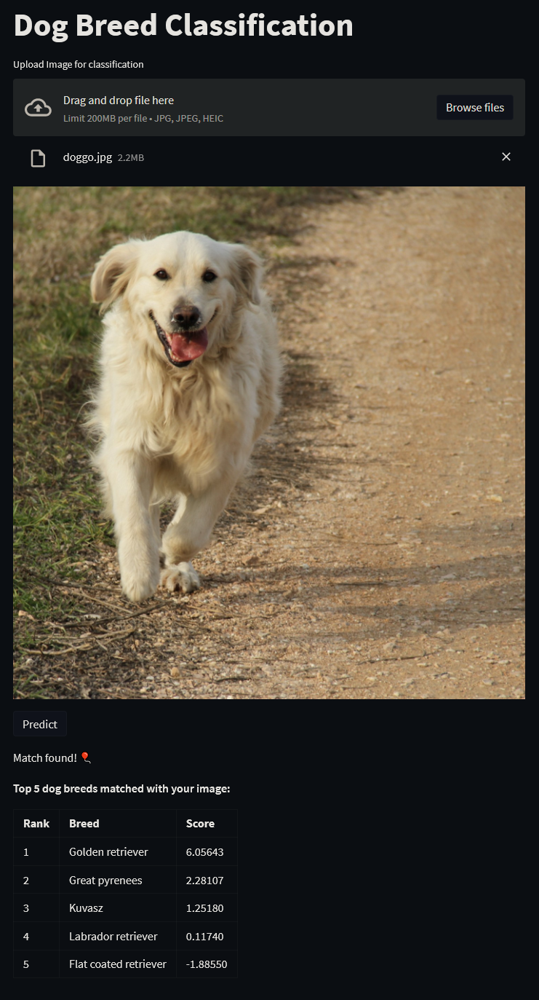


# 7. References

1. Chollet, François (2016). _“xception: Deep Learning with Depthwise Separable Convolutions”_. In: CoRR abs/1610.02357. arXiv: 1610.02357. url: [http://
arxiv.org/abs/1610.02357](http://arxiv.org/abs/1610.02357).

2. Szegedy, Christian, Ioffe, Sergey, and Vanhoucke, Vincent (2016). _“Inception-v4, Inception-ResNet and the Impact of Residual Connections on Learning”_. In: CoRR abs/1602.07261. arXiv: 1602.07261. url: [http://arxiv.org/abs/1602.07261](https://arxiv.org/abs/1602.07261).
   
3. Sandler, Mark, Howard, Andrew G., Zhu, Menglong, Zhmoginov, Andrey, and Chen, Liang-Chieh (2018). _“Inverted Residuals and Linear Bottlenecks: Mobile Networks for Classification, Detection and Segmentation”_. In: CoRR abs/1801.04381. arXiv: 1801 . 04381. url: [https://arxiv.org/abs/1801.04381](https://arxiv.org/abs/1801.04381).
   
4. Tan, Mingxing, Chen, Bo, Pang, Ruoming, Vasudevan, Vijay, Sandler, Mark, Howard, Andrew, and Le, Quoc V. (2019). _MnasNet: Platform-Aware Neural Architecture Search for Mobile_. arXiv: [1807.11626 \[cs.CV\]](https://arxiv.org/abs/1807.11626).

5. Tan, Mingxing and Le, Quoc V. (2020). _EfficientNet: Rethinking Model Scaling for Convolutional Neural Networks_. arXiv: [1905.11946 \[cs.LG\]](https://arxiv.org/abs/1905.11946).

6. Liu, Ze, Lin, Yutong, Cao, Yue, Hu, Han, Wei, Yixuan, Zhang, Zheng, Lin, Stephen, and Guo, Baining (2021). _Swin Transformer: Hierarchical Vision Transformer using Shifted Windows_. arXiv: [2103.14030 \[cs.CV\]](https://arxiv.org/abs/2103.14030).

7. Liu, Zhuang, Mao, Hanzi, Wu, Chao-Yuan, Feichtenhofer, Christoph, Darrell, Trevor, and Xie, Saining (2022). _“A ConvNet for the 2020s”_. In: CoRR abs/2201.03545. arXiv: 2201 . 03545. url: [https://arxiv.org/abs/2201.03545](https://arxiv.org/abs/2201.03545)

8. Aditya Khosla, Nityananda Jayadevaprakash, Bangpeng Yao and Li Fei-Fei. Novel dataset for Fine-Grained Image Categorization. First Workshop on Fine-Grained Visual Categorization (FGVC), IEEE Conference on Computer Vision and Pattern Recognition (CVPR), 2011.

9. J. Deng, W. Dong, R. Socher, L.-J. Li, K. Li and L. Fei-Fei, ImageNet: A Large-Scale Hierarchical Image Database. IEEE Computer Vision and Pattern Recognition (CVPR), 2009.
    
10. Fu, Y. (2020, June 30). Keras documentation: Image Classification via fine-tuning with EfficientNet. [https://keras.io/examples/vision/image_classification_efficientnet_fine_tuning/](https://keras.io/examples/vision/image_classification_efficientnet_fine_tuning/)
