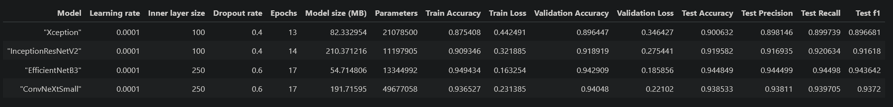

<br><br> 

<p style="text-align:center; background-color: darkgray; color: lightyellow; border-radius:10px; line-height:1.4; font-size:32px; font-weight:bold; padding: 9px;">
            <strong>Dog Breed Image Classification</strong>
</p>  
  
<p style="text-align:center; color: Black; border-radius:10px; font-family:helvetica; line-height:1.0; font-size:28px; font-weight:normal; text-transform: capitalize; padding: 5px;">
    End-to-end Deep Learning Project for
    <br>Dog Breed Multi-Class Image Classification:
    <br>EDA, Transfer Learning, Fine-Tuning, and Model Deployment
</p>

# 1. Introduction

## 1.1 Background

In recent years, the canine population has witnessed a surge in the number of mixed-breed dogs. While the charm of mixed-breed dogs lies in their one-of-a-kind characteristics, the increasing variety poses challenges when it comes to identifying their specific breeds. This is where a classification model proves to be invaluable.

Creating a classification model for identifying breeds of dogs can serve various purposes including:
- Lost and found services to help efficiently reunite lost dogs with owners.
- Educational tools through interactive websites or mobile applications to learn about different breeds.
- Pet adoption platforms to identify breeds within shelters, enhancing adoptiong and rehoming processes.
- Dog shows and competitions to assist judges in verifying participating dog breeds.

The following study explores the multi-class [stanford dogs image dataset](https://www.kaggle.com/datasets/jessicali9530/stanford-dogs-dataset), then uses transfer learning to train and fine-tune four modern neural network architectures. We'll use built-in [Keras applications](https://keras.io/api/applications) to use architectures with pre-trained ImageNet weights for the following models: 
- [xception](https://arxiv.org/abs/1610.02357)
- [InceptionResNetV2](https://arxiv.org/abs/1602.07261)
- [EfficientNetB3](https://arxiv.org/abs/1905.11946)
- [ConvNeXtSmall](https://arxiv.org/abs/2201.03545)

Finally, we'll save the best model with tensorflow lite, create a docker image for the environment with minimized dependencies, and deploy it to the cloud using AWS Lambda.

**WARNING**: Do not attempt to run the enitre notebook without a CUDA-enabled GPU. The models may take hours or even days to train. See section 3.2 for more information on how to check for an available GPU.

## 1.2 Table of Contents.

The table of contents for the repository is as follows.

### 1. Introduction
- 1.1 - Description of the project methodology and real world use-case.
- 1.2 - Table of contents **(We Are Here)**
- 1.3 - Repository structure
- 1.4 - Dataset source and information.
### 2. Environment Installation
- Instructions for creating and running the conda environment, including tensorflow installation.
### 3. Modeling
- 3.1 - xception
- 3.2 - InceptionResNetV2
- 3.3 - EfficientNetB3
- 3.4 - ConvNeXtSmall
- 3.5 - Comparison and analysis of all four tuned models to determine the final model: EfficientNetB3V2
### 4. Deployment
- 4.1 - Local deployment with docker
- 4.2 - Cloud deployment with AWS Lambda and Streamlit
### 5. References
- References for all model architectures and Keras documentation


## 1.3 Repository Structure

The following details the files stored int his repository. Note that the inception and convnext models are excluded due to large file size.


```
dog-prediction
│   README.md
|   Dockerfile - Set up environment with minimized dependencies for local and cloud deployment
│   requirements.txt - Set up local environment for running notebook
│
└───data - Contains images organized by folder for each class (dog breed)
│   
└───figures - Contains images for the notebook and readme
|
└───models
|   │   effnetV2B3_model.keras
|   │   Xception_model.keras
|   │   model.tflite - Minimized dependencies for local and cloud deployment
|
|
└───python
    │   convnext.py - Hotfix for saving convnext models with tensorflow 2.10
    │   lambda_function.py - Function for AWS Lambda cloud deployment
    │   notebook.ipynb - EDA, modeling and hyperparameter tuning
    │   test.py - Tests local inference
    │   test_cloud.py - Tests cloud inference
```

## 1.4 Dataset Source

The Stanford Dogs dataset contain images of dogs from around the world. It is primarily used for image categorization of dog breeds. The version for this project can be downloaded from [Kaggle - Stanford Dogs Dataset](https://www.kaggle.com/datasets/jessicali9530/stanford-dogs-dataset).
- Dog breeds: 120
- Number of images: 20,580
- This project uses the "Images" folder which is divided into subfolders by class (dog breed)

Further observation of the data can be found in section 3.2 EDA

# 2. Environment Installation

### Creating conda environment from requirements.txt

The following will create a conda environment with the necessary requirements for this project.

``conda create --name dog-prediction python=3.10``

``conda activate dog-prediction``

``pip install -r requirements.txt``

This project was created with tensorflow 2.10.0 with GPU support for windows cuda tool kit 11.2 and nvidia cuda-nvcc. The tensorflow installation for your OS may be different. Please refer to the [official documentation](https://www.tensorflow.org/install/pip). 

For a windows build with a cuda-enabled nvidia graphics card, please run the following commands.

``conda install -c conda-forge cudatoolkit=11.2 cudnn=8.1.0``

``conda install -c nvidia cuda-nvcc``

### Creating conda environment from environment.yml

Alternatively, you can run the following command to create the environment dog-prediction directly, with cuda support installed for windows.

``conda env create --file environment.yml``


# 3. Modeling


## 3.1 - Xception

**Reference**
- [xception: Deep Learning with Depthwise Separable Convolutions](https://arxiv.org/abs/1610.02357)

**Base Model Architecture**

xception is "a deep convolutional neural network architecture inspired by Inception, where Inception modules have been replaced with depthwise separable convolutions". It outperforms Inception V3 on ImageNet while having the same number of parameters by making more efficient use of these model parameters. From figure 5 of the paper, the xception architecture: the data first goes through the entry flow, then through the middle flow which is repeated eight times, and finally through the exit flow. Note that all Convolution and SeparableConvolution layers are followed by batch normalization. All SeparableConvolution layers use a depth multiplier of 1 (no depth expansion).


## 3.2 - InceptionResNetV2

[InceptionResNetV2 Application - Keras](https://keras.io/api/applications/inceptionresnetv2/)

**Reference**
- [Inception-v4, Inception-ResNet and the Impact of Residual Connections on Learning](https://arxiv.org/abs/1602.07261) (AAAI 2017)

**Base Model Architecture**

Figures 3-9 from [Inception-v4, Inception-ResNet and the Impact of Residual Connections on Learning](https://arxiv.org/abs/1602.07261) (AAAI 2017). Figure 3 shows the architecture divided into blocks. The full architecture next to it is taken from figures 4-9. Note that each inception block is repeated the number of times as specified in figure 3, and also next to the Filter concat block. For Reduction-B, the k, l, m, n numbers represent filter bank sizes which can be looked up in Table 1.


## 3.3 - EfficientNetB3V2

[EfficientNetB3 Application - Keras](https://keras.io/api/applications/efficientnet/#efficientnetb3-function)

[Efficientnet Fine Tuning - Keras](https://keras.io/examples/vision/image_classification_efficientnet_fine_tuning/)

**Reference**
- [EfficientNet: Rethinking Model Scaling for Convolutional Neural Networks](https://arxiv.org/abs/1905.11946) (ICML 2019)

**Base Model Architecture**

The EfficientNet baseline architecture leverages a multi-objective neural architecture search that optimizes both accuracy and FLOPS. EfficientNetB0 is shown in Table 1 below from the paper, using MBConv layers from ([Sandler et al., 2018](https://arxiv.org/abs/1801.04381); [Tan et al., 2019](https://arxiv.org/abs/1807.11626)). EfficientNetB3 is a scaled-up version, using uniform dimension scaling as shown in (e) from the figure 2 below.


## 3.4 - ConvNeXtSmall

[ConvNeXtSmall Application - Keras](https://keras.io/api/applications/convnext/#convnextsmall-function)

**Reference**
- [A ConvNet for the 2020s](https://arxiv.org/abs/2201.03545) (CVPR 2022)

**Base Model Architecture**

ConvNeXt is a family of architectures that aims to make transformers viable for computer vision, aiding in tasks suck as object detection and semantic segmentation. They outperform other transformers while maintaining the simplicity and efficiency of standard ConvNets. Table 9 from the paper shows the architecture for ConvNeXt-T compared with ResNet-50 () and Swin-T (Ze et al, 2021)[https://arxiv.org/abs/2103.14030]. For differently sized ConvNeXts, only the number of blocks and the number of channels at each stage differ from ConvNeXt-T. The number of channels doubles at each new stage, so ConvNeXt-Small has double the number of channels.


## 3.5 - Compare all models

The following table compiles performance metrics for all four trained models. EfficientNetB3V2 is our best performing model across all metrics. It also has the smallest size and a relatively small number of parameters, so we can assume it will run fairly fast.




# 4 Deployment

## 4.1 - Local Deployment

To deploy locally, navigate up to the root folder and run the following from a terminal or command prompt. Please note that docker must already be installed on your local machine. See the [official documentation](https://docs.docker.com/engine/install/) for Docker Engine installation.

- Build the container: `docker build -t dog-prediction .`
- Run the container: `docker run -it -rm -p 8080:8080 clothing-model:latest`

This will build an image from the [dockerfile](../Dockerfile) using python 3.10, tflite and [lambda_function.py](lambda_function.py). Once the container is running, a test can be run from the python folder with the command ``python test.py``. It is expected to return 'Redbone'.

## 4.2 - Cloud Deployment

The model is also deployed to an AWS Lambda function hosted by a docker image on AWS EC2. Run ``python test_cloud.py`` to run inference on the cloud model instead. It also also expected to return the dog breed for the example image, 'Redbone'


# 5. References

1. Chollet, François (2016). _“xception: Deep Learning with Depthwise Separable Convolutions”_. In: CoRR abs/1610.02357. arXiv: 1610.02357. url: [http://
arxiv.org/abs/1610.02357](http://arxiv.org/abs/1610.02357).

2. Szegedy, Christian, Ioffe, Sergey, and Vanhoucke, Vincent (2016). _“Inception-v4, Inception-ResNet and the Impact of Residual Connections on Learning”_. In: CoRR abs/1602.07261. arXiv: 1602.07261. url: [http://arxiv.org/abs/1602.07261](https://arxiv.org/abs/1602.07261).
   
3. Sandler, Mark, Howard, Andrew G., Zhu, Menglong, Zhmoginov, Andrey, and Chen, Liang-Chieh (2018). _“Inverted Residuals and Linear Bottlenecks: Mobile Networks for Classification, Detection and Segmentation”_. In: CoRR abs/1801.04381. arXiv: 1801 . 04381. url: [https://arxiv.org/abs/1801.04381](https://arxiv.org/abs/1801.04381).
   
4. Tan, Mingxing, Chen, Bo, Pang, Ruoming, Vasudevan, Vijay, Sandler, Mark, Howard, Andrew, and Le, Quoc V. (2019). _MnasNet: Platform-Aware Neural Architecture Search for Mobile_. arXiv: [1807.11626 \[cs.CV\]](https://arxiv.org/abs/1807.11626).

5. Tan, Mingxing and Le, Quoc V. (2020). _EfficientNet: Rethinking Model Scaling for Convolutional Neural Networks_. arXiv: [1905.11946 \[cs.LG\]](https://arxiv.org/abs/1905.11946).

6. Liu, Ze, Lin, Yutong, Cao, Yue, Hu, Han, Wei, Yixuan, Zhang, Zheng, Lin, Stephen, and Guo, Baining (2021). _Swin Transformer: Hierarchical Vision Transformer using Shifted Windows_. arXiv: [2103.14030 \[cs.CV\]](https://arxiv.org/abs/2103.14030).

7. Liu, Zhuang, Mao, Hanzi, Wu, Chao-Yuan, Feichtenhofer, Christoph, Darrell, Trevor, and Xie, Saining (2022). _“A ConvNet for the 2020s”_. In: CoRR abs/2201.03545. arXiv: 2201 . 03545. url: [https://arxiv.org/abs/2201.03545](https://arxiv.org/abs/2201.03545)

8. Aditya Khosla, Nityananda Jayadevaprakash, Bangpeng Yao and Li Fei-Fei. Novel dataset for Fine-Grained Image Categorization. First Workshop on Fine-Grained Visual Categorization (FGVC), IEEE Conference on Computer Vision and Pattern Recognition (CVPR), 2011.

9. J. Deng, W. Dong, R. Socher, L.-J. Li, K. Li and L. Fei-Fei, ImageNet: A Large-Scale Hierarchical Image Database. IEEE Computer Vision and Pattern Recognition (CVPR), 2009.
    
10. Fu, Y. (2020, June 30). Keras documentation: Image Classification via fine-tuning with EfficientNet. [https://keras.io/examples/vision/image_classification_efficientnet_fine_tuning/](https://keras.io/examples/vision/image_classification_efficientnet_fine_tuning/)
